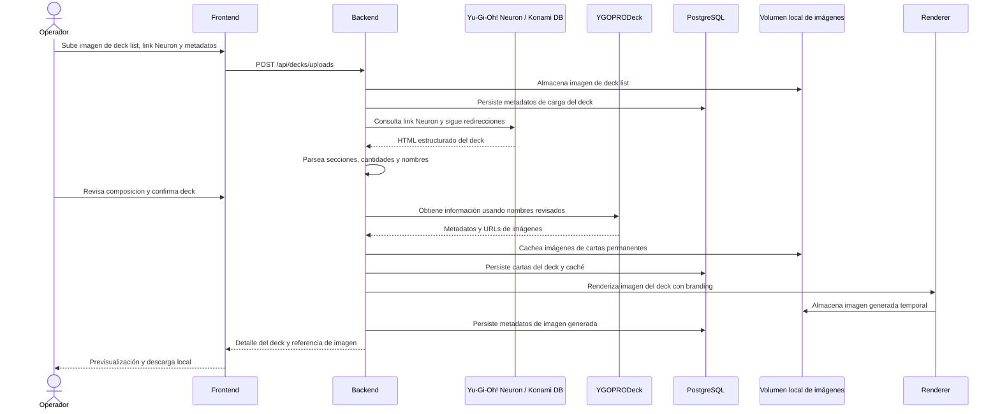

# YugiDeckStudio v0.1.0 - Diseño

## 1. Visión general

YugiDeckStudio se implementará como una aplicación full-stack local basada en Docker Compose.

El sistema recibe una imagen subida de deck list de Yu-Gi-Oh! como evidencia, exige un link publico de Yu-Gi-Oh! Neuron para importar la composicion estructurada del deck, permite revisar la composicion, obtiene informacion de cartas desde YGOPRODeck usando los nombres revisados, cachea datos e imagenes, persiste el flujo completo del deck en PostgreSQL local y genera una imagen compartible con branding.

La versión `v0.1.0` no contempla despliegue a internet. La aplicación debe poder ejecutarse completamente en una máquina local, usando internet solo para consultar YGOPRODeck cuando no exista caché local.

## 2. Arquitectura

Arquitectura seleccionada:

- Backend: Clean Architecture / Hexagonal Architecture.
- Frontend: arquitectura modular basada en features.
- Stack backend: NestJS + TypeScript.
- Stack frontend: React + Vite + TypeScript.
- Renderizado de imágenes: node-canvas.
- ORM y migraciones: Prisma.
- Pruebas backend: Jest.
- Pruebas frontend: Vitest + Testing Library.
- Server state frontend: TanStack Query.
- Imagen generada: `1080x1350` px.
- Plantillas: una plantilla base parametrizable para `v0.1.0`.
- Base de datos: PostgreSQL local.
- Infraestructura: Docker Compose local.
- Almacenamiento de imágenes: volumen Docker local.

El backend debe separar:

- Modelos y reglas de dominio.
- Casos de uso de aplicación.
- Puertos/interfaces.
- Adaptadores de infraestructura.
- Controladores HTTP/API.

Sistemas externos como Yu-Gi-Oh! Neuron/Konami, YGOPRODeck, almacenamiento de archivos y generacion de imagenes deben accederse mediante puertos y adaptadores.

## 3. Módulos backend propuestos

### Dominio

- Deck.
- DeckStatus.
- DeckSection.
- DeckCard.
- Card.
- Player.
- Tournament.
- TournamentStatus.
- EventType.
- Store.
- StoreBranding.
- StoreSocialLink.
- User.
- Role.
- Permission.
- ManagedImageAsset.
- GeneratedDeckImage.
- ImageRetentionPolicy.

### Casos de uso de aplicación

- UploadDeckListImageUseCase.
- ImportDeckListFromNeuronUseCase.
- ListDecksUseCase.
- FetchCardDataUseCase.
- CacheCardImageUseCase.
- GenerateDeckImageUseCase.
- ConfigureStoreBrandingUseCase.
- ConfigureEventTypesUseCase.
- ConfigureTournamentsUseCase.
- CloseTournamentUseCase.
- ConfigureStoreSocialLinksUseCase.
- RegisterUserUseCase.
- LoginUserUseCase.
- InitializeRootUserUseCase.
- ConfigureFirstStoreAdminUseCase.
- ConfigureRolesUseCase.
- ConfigurePermissionsUseCase.
- AssignRoleToUserUseCase.
- AssignPermissionToRoleUseCase.
- CleanupTemporaryImagesUseCase.
- GetDeckDetailUseCase.

### Puertos

- NeuronDeckImportPort.
- CardCatalogPort.
- CardImageStoragePort.
- DeckImageRendererPort.
- DeckRepository.
- CardRepository.
- BrandingRepository.
- EventTypeRepository.
- TournamentRepository.
- UserRepository.
- RoleRepository.
- PermissionRepository.
- ImageAssetRepository.
- PasswordHasherPort.
- AuthTokenPort.
- AuthorizationPolicyPort.
- FileStoragePort.
- SchedulerPort.

### Adaptadores de infraestructura

- YgoprodeckCardCatalogAdapter.
- PostgresDeckRepository.
- PostgresCardRepository.
- PostgresBrandingRepository.
- PostgresEventTypeRepository.
- PostgresTournamentRepository.
- PostgresUserRepository.
- PostgresRoleRepository.
- PostgresPermissionRepository.
- PostgresImageAssetRepository.
- BcryptPasswordHasherAdapter.
- LocalJwtAuthTokenAdapter.
- PermissionAuthorizationPolicyAdapter.
- LocalDockerVolumeFileStorageAdapter.
- KonamiNeuronDeckImportAdapter.
- NodeCanvasDeckImageRendererAdapter.
- LocalSchedulerAdapter.

## 4. Módulos frontend propuestos

- Página de carga de deck con listado de decks visibles y acciones directas de revision/generacion.
- Pagina interna de revision de deck, accesible desde la carga o desde el listado.
- Modal desktop de revision de deck, abierto desde `Decks` sin cambiar de modulo.
- Modal desktop de generacion de imagen, cacheo, previsualizacion y descarga.
- Vista mobile completa para revision y generacion cuando el viewport no permite modales ergonomicos.
- Página de configuración de tienda.
- Página de configuración de eventos.
- Página de configuración de torneos.
- Página de configuración de redes sociales.
- Página de login.
- Página de registro.
- Página de configuración de usuarios.
- Página de configuración de roles y permisos.
- Panel de previsualizacion y descarga de imagen generada dentro de la pantalla `Decks`.
- Persistencia de sesion autenticada en almacenamiento local del navegador con `lastActivityAt` y expiracion por inactividad de 20 minutos.
- Componentes UI compartidos.
- Módulo cliente de API.

## 5. Flujo principal

1. El operador sube una imagen de deck list como evidencia, torneo seleccionado, resultado controlado, metadatos obligatorios y link Neuron.
2. El backend valida metadatos, restricciones del archivo y dominio del link Neuron.
3. El backend almacena la imagen en el volumen local de imagenes.
4. El backend consulta el link Neuron y sigue redirecciones validas hacia Konami.
5. El backend parsea secciones, cantidades y nombres oficiales desde HTML estructurado.
6. El backend persiste metadatos, link Neuron, imagen de evidencia y cartas importadas en PostgreSQL.
7. El operador revisa y corrige la lista importada cuando haga falta.
8. El operador confirma el deck cuando la composicion es valida.
9. El backend consulta YGOPRODeck con los nombres revisados cuando se cachean imagenes.
10. El backend cachea metadatos e imagenes de cartas.
11. El backend persiste la composicion final del deck.
12. El backend renderiza la imagen del deck con branding.
13. El backend almacena la imagen generada en el volumen local de imagenes.
14. El backend cierra automaticamente el torneo si la carga completa 1 `Ganador`, 1 `Segundo Puesto`, 2 `Top 3 - 4` y 4 `Top 8`.
15. El frontend muestra previsualizacion y accion de descarga local dentro de `Decks`.

## 5.1 Flujo de experiencia responsive en Decks

La pantalla `Decks` concentra las acciones operativas del deck para evitar navegar entre menus separados.

Reglas de UI:

- En desktop, `Revisar` abre `DeckReviewWorkspace` dentro de un dialog modal con scroll interno.
- En desktop, `Generar imagen` abre el flujo de cacheo, generacion, previsualizacion y descarga dentro de un dialog modal.
- En mobile, `Revisar` y `Generar imagen` reemplazan temporalmente el contenido de `Decks` por una vista completa con accion `Volver`.
- Las filas de decks deben adaptarse a una columna en mobile y usar todo el ancho disponible en desktop.
- El menu lateral no debe incluir accesos separados de revision ni de imagen.

## 5.2 Diseno de sesion local e inactividad

El login sigue usando el token JWT local emitido por backend. Para soportar refresco de navegador, el frontend conserva la sesion autenticada en `localStorage` bajo una clave local de la aplicacion.

Forma logica almacenada:

```json
{
  "accessToken": "jwt-local",
  "user": {},
  "lastActivityAt": 1770000000000
}
```

Reglas:

- Al iniciar la aplicacion, el frontend restaura la sesion si `Date.now() - lastActivityAt` es menor a 20 minutos.
- Actividad local del usuario, como click, teclado, scroll, touch o foco de ventana, actualiza `lastActivityAt`.
- Un intervalo local verifica la inactividad y, si llega a 20 minutos, elimina la sesion y vuelve al login.
- El evento `storage` sincroniza logout entre pestanas del mismo navegador.
- El timeout de inactividad es una regla de frontend local para seguridad de uso; no reemplaza la expiracion criptografica del JWT configurada en backend.

## 6. Propuesta de modelo de datos

### stores

- id.
- name.
- primary_logo_asset_id.
- secondary_logo_asset_id.
- background_image_asset_id.
- source_credit_text.
- created_at.
- updated_at.

### store_social_links

- id.
- store_id.
- platform.
- handle.
- url.
- icon_asset_id.
- display_order.
- is_active.

### users

- id.
- store_id. Nulo únicamente para `root`.
- username.
- email.
- password_hash.
- display_name.
- is_root.
- must_change_password.
- is_active.
- created_at.
- updated_at.

### roles

- id.
- name.
- description.
- is_system_role.
- created_at.
- updated_at.

### permissions

- id.
- code.
- description.
- created_at.
- updated_at.

### stores

Los datos asociados a una tienda deben usar `store_id` para aplicar aislamiento multi-tienda.

Las entidades con alcance de tienda incluyen:

- store_social_links.
- event_types.
- tournament_types.
- tournaments.
- decks.
- generated_deck_images mediante deck.
- usuarios no-root.
- assets configurables de tienda, evento, redes y fondos.

### user_roles

- user_id.
- role_id.

### role_permissions

- role_id.
- permission_id.

### event_types

- id.
- store_id.
- name.
- description.
- logo_asset_id.
- is_active.
- created_at.
- updated_at.

### tournaments

- id.
- store_id.
- event_type_id.
- name.
- description.
- logo_asset_id.
- event_date.
- location.
- status. Valores: `OPEN`, `CLOSED`.
- closed_at.
- closed_by_user_id.
- closure_reason.
- created_at.
- updated_at.

### players

- id.
- display_name.
- created_at.
- updated_at.

### decks

- id.
- player_id.
- tournament_id.
- store_id.
- deck_name.
- result_label.
- uploaded_image_asset_id.
- neuron_deck_url.
- extraction_status.
- review_status.
- status.
- inactive_at.
- inactive_by_user_id.
- inactivity_reason.
- created_at.
- updated_at.

### deck_cards

- id.
- deck_id.
- section.
- quantity.
- original_name.
- resolved_english_name.
- card_id.
- confidence_score.
- resolution_status.
- display_order.

### cards

- id.
- ygoprodeck_id.
- official_name.
- card_type.
- frame_type.
- image_asset_id.
- image_url_source.
- raw_payload_json.
- last_used_at.
- created_at.
- updated_at.

### generated_deck_images

- id.
- deck_id.
- image_asset_id.
- template_name.
- width. Valor esperado para `v0.1.0`: `1080`.
- height. Valor esperado para `v0.1.0`: `1350`.
- created_at.

### managed_image_assets

- id.
- category.
- storage_path.
- original_filename.
- mime_type.
- size_bytes.
- checksum.
- width.
- height.
- retention_policy.
- last_used_at.
- created_at.
- deleted_at.

Categorías propuestas:

- `uploaded_decklist`.
- `generated_deck_image`.
- `card_image`.
- `store_logo`.
- `event_logo`.
- `social_logo`.
- `background_image`.

Políticas de retención propuestas:

- `temporary_cleanup_allowed` para deck lists subidos e imágenes generadas.
- `permanent` para cartas, logos de tienda, logos de evento, logos/iconos de redes sociales y fondos activos.

## 7. API documentada

Los contratos finales de API estan documentados en `specs/api-contract.md`. Endpoints principales de `v0.1.0`:

- `POST /api/decks/uploads`
- `GET /api/decks`
- `GET /api/decks/{deckId}/cards`
- `PUT /api/decks/{deckId}/cards`
- `POST /api/decks/{deckId}/cache-card-images`
- `POST /api/decks/{deckId}/generate-image`
- `POST /api/decks/{deckId}/inactivate`
- `GET /api/stores/{storeId}`
- `PUT /api/stores/{storeId}`
- `POST /api/stores/{storeId}/assets`
- `GET /api/stores/{storeId}/event-types`
- `POST /api/stores/{storeId}/event-types`
- `PUT /api/stores/{storeId}/event-types/{eventTypeId}`
- `GET /api/stores/{storeId}/tournaments`
- `GET /api/stores/tournaments`
- `POST /api/stores/{storeId}/tournaments`
- `PUT /api/stores/{storeId}/tournaments/{tournamentId}`
- `POST /api/stores/{storeId}/tournaments/{tournamentId}/close`
- `GET /api/stores/{storeId}/social-links`
- `PUT /api/stores/{storeId}/social-links`
- `POST /api/auth/register`
- `POST /api/auth/login`
- `POST /api/auth/change-password`
- `POST /api/auth/root/initialize`
- `POST /api/auth/root/store-admin`
- `GET /api/auth/users`
- `GET /api/auth/roles`
- `POST /api/auth/roles`
- `PUT /api/auth/roles/{roleId}`
- `GET /api/auth/permissions`
- `POST /api/auth/permissions`
- `PUT /api/auth/permissions/{permissionId}`
- `PUT /api/auth/roles/{roleId}/permissions`
- `PUT /api/auth/users/{userId}/roles`
- `POST /api/maintenance/image-cleanup/run`

## 7.1 Diseño de configuración de tienda

La configuracion recibe `store_id` explicito por ruta y el backend valida el alcance de tienda contra el usuario autenticado, salvo para `root`.

El módulo de tiendas debe permitir:

- consultar y actualizar branding de tienda;
- subir logos, iconos y fondos como assets permanentes;
- configurar eventos por tienda;
- configurar torneos por tienda y asociarlos a un evento;
- reemplazar la lista de redes sociales por tienda.

Reglas:

- Logos primario y secundario de tienda usan assets `store_logo`.
- Fondos propios usan assets `background_image`.
- Logos de eventos usan assets `event_logo`.
- Logos de torneos usan assets `tournament_logo`.
- Iconos de redes sociales usan assets `social_logo`.
- Todos los assets configurables usan política `permanent`.
- Los updates de eventos, torneos y redes siempre filtran por `store_id`.
- La generación de imagen consume estos valores desde PostgreSQL y nunca desde datos hardcodeados.

## 7.2 Diseño de torneos y cierre

Los eventos (`EventType`) son catalogos de variedades de torneo de una tienda y permanecen activos/inactivos para controlar disponibilidad.

Los torneos (`Tournament`) son instancias operativas asociadas a un evento. Un evento puede tener muchos torneos, pero cada torneo pertenece a un solo evento.

Reglas:

- La pantalla inicial autenticada lista torneos visibles, no eventos.
- Cada torneo muestra nombre como dato principal y evento asociado como dato secundario.
- Cada torneo tiene estado `OPEN` o `CLOSED`.
- La carga de deck selecciona un torneo abierto existente.
- El resultado de deck se limita a `Ganador`, `Segundo Puesto`, `Top 3 - 4` y `Top 8`.
- El cierre manual se permite cuando el torneo tiene al menos un deck `Ganador`.
- El cierre automatico se ejecuta despues de cargar deck cuando la distribucion del torneo sea exactamente 1 `Ganador`, 1 `Segundo Puesto`, 2 `Top 3 - 4` y 4 `Top 8`.
- Un torneo cerrado bloquea nuevas cargas.
- El logo de torneo se almacena como asset permanente y se renderiza en la parte superior derecha de la imagen generada.

## 8. Diseño de generación de imagen

La plantilla por defecto debe soportar:

- Tamaño final `1080x1350` px.
- Layout vertical para redes sociales.
- Área superior con logos configurables.
- Área de título con resultado del torneo y nombre del jugador.
- Tipo de evento o torneo cuando aplique.
- Grilla de Main Deck.
- Fila o grilla de Extra Deck.
- Fila o grilla de Side Deck.
- Área inferior con redes sociales y fuente/crédito.

El renderer debe recibir datos estructurados del deck y configuración de branding. No debe consultar APIs externas directamente.

Si el torneo tiene logo activo, el renderer debe dibujarlo en el slot superior derecho. Ese logo tiene prioridad visual sobre logos heredados de evento en esa posicion.

La grilla del Main Deck debe adaptar columnas y tamaño de carta para renderizar decks legales completos, incluyendo Main Deck de 40 a 60 cartas, sin truncar cartas expandidas por cantidad. Extra Deck y Side Deck deben renderizar hasta 15 cartas cada uno.

La versión `v0.1.0` tendrá una sola plantilla base parametrizable.

La tienda puede configurar fondo propio o color de fondo. Si existe fondo propio activo, el renderer debe usarlo con prioridad. Si no existe fondo propio activo, debe usar el color de fondo configurado por la tienda.

El caso de uso de generación debe validar antes del renderizado:

- revision de importacion Neuron confirmada;
- todas las entradas del deck vinculadas a metadatos `Card`;
- todas las cartas con `image_asset_id` activo;
- rutas locales seguras resueltas desde el volumen configurado.

La salida del renderer se guarda como PNG, se registra en `managed_image_assets` con categoría `generated_deck_image`, política `temporary_cleanup_allowed` y dimensiones `1080x1350`, y se vincula en `generated_deck_images`.

## 8.1 Diseño de autenticación y autorización

La aplicación tendrá autenticación local.

El usuario `root` será el usuario de mayor privilegio y debe existir para inicializar la tienda.

El usuario `root` se crea como primer usuario de la base de datos mediante seed/migración inicial con credenciales genéricas locales.

El usuario `root` debe tener `must_change_password = true` hasta que cambie su contraseña en el primer inicio de sesión.

Responsabilidades de `root`:

- Crear o parametrizar el primer usuario administrador de tienda.
- Crear y administrar tiendas.
- Crear y editar roles.
- Crear y editar permisos cuando aplique.
- Asignar permisos a roles.
- Asignar roles a usuarios.
- Ver y administrar información de todas las tiendas.

Las contraseñas deben almacenarse usando hashing seguro.

La autorización debe basarse en permisos, no solo en nombres de rol.

Los controladores HTTP deben validar permisos antes de ejecutar casos de uso protegidos.

La autorización también debe validar alcance:

- `global`: permitido únicamente para `root`.
- `store`: permitido para usuarios no-root dentro de su `store_id`.

Los usuarios no-root siempre deben estar vinculados a una tienda.

Los repositorios y casos de uso deben recibir el contexto del usuario autenticado para aplicar filtros por `store_id`.

No se permite confiar únicamente en filtros de frontend para aislar información.

Roles iniciales recomendados:

- `root`.
- `store_admin`, mostrado en UI como "Administrador de tienda".
- `operator`.

Reglas de usuarios:

- Solo puede existir un `root` en toda la aplicación.
- Cada tienda puede tener un solo `store_admin`.
- Cada tienda puede tener N usuarios `operator`.
- Solo `root` puede crear tiendas.
- Solo `root` puede crear o parametrizar el primer `store_admin` de una tienda.
- `root` puede crear operadores en cualquier tienda.
- `store_admin` puede crear operadores en su tienda.
- `operator` no puede crear usuarios.

Implementación inicial `v0.1.0`:

- `InitializeRootUserUseCase` crea el único root local y roles de sistema.
- `LoginUseCase` autentica credenciales locales y emite JWT.
- `ChangePasswordUseCase` limpia `must_change_password`.
- `ConfigureFirstStoreAdminUseCase` permite a `root` crear la tienda y su primer administrador, o asignar el primer administrador a una tienda existente.
- `RegisterUserUseCase` crea usuarios locales no-root como `operator` vinculados a una tienda.
- `JwtAuthGuard` valida el token local.
- `RootOnlyGuard` bloquea operaciones root si el usuario no es root o si `must_change_password = true`.
- El seed inicial crea `root` solo cuando no existen usuarios previos.

Reglas de navegación frontend:

- Sin sesión activa, la navegación debe mostrar solo `Login`.
- `Cambio de contraseña` es un estado interno obligatorio cuando `mustChangePassword = true`; no debe mostrarse como botón de navegación.
- Mientras `mustChangePassword = true`, la UI debe bloquear el resto de módulos y mostrar únicamente el formulario de cambio de contraseña.
- `Registro` solo debe mostrarse después de iniciar sesión y únicamente para `root`.
- Los usuarios no-root no deben ver la opción `Registro`, incluso si el backend rechazaría la operación por permisos.
- Después de iniciar sesión, la vista por defecto debe ser el index de torneos configurados.
- El index de torneos debe listar torneos filtrados por la tienda del usuario no-root; `root` puede ver torneos de todas las tiendas.
- La navegación autenticada no debe exponer un menu separado de `Imagen`; la generacion y previsualizacion viven dentro de `Decks`.
- `operator`, `store_admin` y `root` pueden crear y modificar eventos dentro de su alcance.
- La eliminación de eventos debe ser soft delete mediante inactivación (`isActive = false`) y solo debe estar disponible para `store_admin` y `root`.

Reglas de seleccion de datos relacionados en frontend:

- El menu lateral debe mantenerse fijo en la parte superior de la pantalla autenticada y no debe desplazarse hacia abajo cuando una vista tenga mas contenido vertical.
- Los campos que referencian entidades persistidas deben ser listas desplegables alimentadas por API: tienda, logos/assets configurables, eventos y torneos.
- Los formularios no deben permitir digitar manualmente IDs de tienda, assets, eventos o torneos.
- Las listas desplegables de tienda y assets deben respetar el aislamiento multi-tienda: `root` puede listar todas las tiendas; usuarios no-root solo reciben su tienda y sus assets.
- La configuracion de tienda debe soportar modo de creacion para `root`; si no existen tiendas, no debe exigir seleccion previa y debe crear la primera tienda desde el formulario.
- En configuracion de tienda, el campo `sourceCreditText` debe mostrarse como `Credito inferior` o `Fuente del deck list`; no representa el encabezado principal de la imagen.
- El encabezado principal de la imagen generada debe derivarse de datos del torneo/evento, ubicacion, resultado alcanzado y nombre del duelista.

Permisos iniciales:

- `root`: todos los permisos globales.
- `store_admin`: configuración de tienda, eventos, torneos, redes, logos, usuarios operadores, decks e imágenes de su tienda.
- `operator`: carga de deck lists, revision de importacion, corrección previa a generación, generación y descarga de imágenes de su tienda.

Implementación de roles y permisos:

- `ConfigureRolesUseCase` crea, actualiza y lista roles.
- `ConfigurePermissionsUseCase` crea, actualiza y lista permisos.
- `AssignPermissionsToRoleUseCase` reemplaza permisos asignados a un rol.
- `AssignRolesToUserUseCase` reemplaza roles asignados a un usuario.
- `PermissionGuard` evalúa permisos declarados por `RequirePermissions`.
- El permiso inicial `security.manage` protege la administración de roles y permisos.
- `root` puede ejecutar operaciones protegidas sin depender de permisos persistidos.
- Usuarios no-root se autorizan mediante permisos persistidos en `role_permissions`.

Implementación de aislamiento multi-tienda:

- `StoreAccessPolicyService` permite acceso global a `root` y compara `user.store_id` contra el `store_id` solicitado para usuarios no-root.
- `StoreScopeGuard` valida endpoints que reciben `storeId` en ruta o body.
- `DeckScopeGuard` resuelve `deck.store_id` desde PostgreSQL antes de ejecutar operaciones de deck.
- Los endpoints de configuración de tienda usan `JwtAuthGuard` + `StoreScopeGuard`.
- Los endpoints de decks usan `JwtAuthGuard` + `StoreScopeGuard` para carga y `JwtAuthGuard` + `DeckScopeGuard` para operaciones por `deckId`.
- La carga `POST /api/decks/uploads` usa `multipart/form-data`; por ello debe aplicar `JwtAuthGuard` y validar `storeId` con `StoreAccessPolicyService` dentro del controller despues de que `FileInterceptor` parsee el formulario.
- Usuarios con `must_change_password = true` no pueden operar recursos de tienda.

## 8.2 Diseño de ciclo de vida del deck

Estados propuestos de deck:

- `uploaded`.
- `extracted`.
- `reviewed`.
- `image_generated`.
- `inactive`.

Reglas:

- El deck list subido no se puede reemplazar sobre el mismo deck.
- La revision de importacion Neuron es obligatoria antes de generar imagen.
- Antes de generar imagen se permite corregir cartas importadas.
- La corrección reemplaza la lista completa de cartas del deck mientras la revisión esté pendiente.
- En frontend, cualquier edicion o eliminacion local de cartas importadas debe marcar la revision como pendiente de guardado y bloquear `Confirmar deck` hasta persistir las correcciones.
- En frontend, la eliminacion de una carta extraida se aplica localmente y se persiste mediante el mismo contrato `PUT /api/decks/{deckId}/cards`, que reemplaza la lista completa.
- En frontend, `Confirmar deck` solo debe habilitarse cuando no existan cambios locales sin guardar y la composicion sea valida.
- La pantalla de revision debe mostrar seccion, cantidad, nombre y orden para validacion visual del operador.
- La pantalla de revision debe mostrar conteos por seccion y permitir agregar filas manuales cuando la importacion Neuron requiere ajuste manual.
- La confirmacion de revision y la generacion de imagen deben validar composicion de deck: `Main Deck` entre 40 y 60 cartas, `Extra Deck` maximo 15 cartas y `Side Deck` maximo 15 cartas.
- Confirmar revisión cambia `review_status` a `CONFIRMED` y `status` a `REVIEWED`.
- Después de generar imagen, el operador no puede eliminar ni inactivar el deck.
- Después de generar imagen, solo `store_admin` o `root` pueden inactivar el deck.
- Inactivar el deck aplica soft delete o estado inactivo sobre la data.
- Los archivos físicos de deck list subido e imagen generada pueden eliminarse según retención o inactivación administrativa.

Implementación:

- `InactivateDeckUseCase` valida que el deck exista y tenga `status = IMAGE_GENERATED`.
- `InactivateDeckUseCase` permite la operación solo a `root` o usuarios con rol `store_admin`.
- La operación conserva la data histórica y cambia el deck a `INACTIVE`.
- Se registran `inactive_at`, `inactive_by_user_id` e `inactivity_reason`.
- Los assets `uploaded_decklist` y `generated_deck_image` asociados se marcan con `deleted_at`.
- Los archivos físicos del deck list subido y de las imágenes generadas se eliminan del volumen local.
- No se eliminan assets permanentes como cartas, logos, fondos o redes sociales.

## 8.2.1 Diseño de repositorios de persistencia de deck

Los casos de uso de deck no deben depender directamente de Prisma cuando la operación represente una regla de aplicación reutilizable.

Para `v0.1.0`, `DeckPersistenceRepository` actúa como puerto de persistencia para operaciones críticas del ciclo de vida:

- consultar el estado de revisión requerido antes de generar imágenes;
- consultar el snapshot de inactivación del deck con sus assets temporales asociados;
- marcar el deck como `INACTIVE` y marcar como eliminados los assets temporales relacionados.

`PostgresDeckPersistenceRepository` implementa el puerto usando Prisma y PostgreSQL.

Reglas:

- `DeckReviewPolicyService` debe validar la revisión mediante el puerto de repositorio.
- `DeckCompositionPolicyService` debe validar conteos antes de confirmar revision o generar imagen.
- `InactivateDeckUseCase` debe inactivar decks mediante el puerto de repositorio.
- La eliminación física de archivos permanece separada en el adaptador de almacenamiento local.
- Las pruebas deben cubrir el contrato del repositorio y el desacoplamiento de los casos de uso.

## 8.3 Diseño de modo sin internet

La integración con YGOPRODeck debe soportar fallo de conectividad.

Reglas:

- Si todas las cartas e imágenes requeridas están cacheadas localmente, la imagen puede generarse sin internet.
- Si falta alguna carta o imagen y no hay conexión a YGOPRODeck, la generación debe bloquearse.
- El error debe informar qué cartas o imágenes faltan.

## 9. Diseno de importacion Neuron y revision de deck

La importacion de Yu-Gi-Oh! Neuron se aisla detras de `NeuronDeckImportPort`.

El adaptador `KonamiNeuronDeckImportAdapter` debe:

- aceptar unicamente links con hostname `neuron.konami.net` o `www.db.yugioh-card.com`;
- seguir redirecciones HTTP validas desde Neuron hacia la base de datos publica de Konami;
- rechazar links con otros protocolos u hostnames para reducir riesgo SSRF;
- leer HTML con codificacion UTF-8;
- extraer la lista estructurada desde tablas `monster_list`, `spell_list`, `trap_list`, `extra_list` y `side_list` cuando existan;
- normalizar entidades HTML, espacios y saltos de linea;
- mapear monstruos, magicas y trampas a `DeckSection.MAIN`;
- mapear Extra Deck a `DeckSection.EXTRA`;
- mapear Side Deck a `DeckSection.SIDE`;
- rechazar respuestas sin cartas parseables.

La carga de deck debe usar el link Neuron para importar cartas en el mismo flujo que persiste la imagen de evidencia y los metadatos. Si la importacion falla, el backend no debe crear decks incompletos.

El OCR y Tesseract no forman parte del diseno vigente. La imagen subida no se usa para leer cartas; se conserva como soporte visual y auditoria local.

La revision de deck debe:

- Conservar el nombre importado desde Neuron.
- Permitir editar seccion, cantidad, nombre y orden.
- Permitir eliminar cartas que no pertenezcan al deck.
- Permitir agregar cartas faltantes antes de guardar.
- Confirmar el deck sin exponer una accion separada de resolucion de nombres.

La ventana de carga de decks debe listar los decks visibles para el usuario autenticado. `root` ve decks de todas las tiendas y los usuarios no-root solo ven decks de su tienda. Cada fila debe permitir abrir la revision del deck seleccionado y generar la imagen del deck confirmado sin digitar manualmente el Deck ID.

La accion `Generar imagen` en `Decks` debe ejecutar primero el cacheo de imagenes de cartas. Si no hay faltantes, debe invocar la generacion final, mostrar la previsualizacion y ofrecer descarga PNG en la misma pantalla. Si hay faltantes, debe mostrar la lista de dependencias faltantes y detener la generacion final.

El frontend debe usar layouts responsivos: en escritorio el workspace principal ocupa el ancho disponible; en pantallas estrechas, sidebar, formularios, tablas, filas de deck, revision y previsualizacion deben adaptarse a una sola columna sin overflow horizontal.

El cacheo de imagenes usa los nombres revisados para consultar YGOPRODeck internamente. Si YGOPRODeck no encuentra una carta o devuelve multiples coincidencias, el cacheo debe reportar la dependencia faltante para que el usuario corrija el nombre en la revision del deck.
## 10. Diseño de integración con YGOPRODeck

El acceso a YGOPRODeck se aísla detrás de `CardCatalogPort`.

El adaptador debe:

- Respetar límites de solicitudes.
- Consultar caché local antes de realizar llamadas HTTP.
- Consultar por `name` exacto y usar `fname` difuso como fallback cuando no haya resultado exacto.
- Agrupar búsquedas cuando sea posible usando `name` con nombres separados por `|`.
- Almacenar payloads de API para trazabilidad.
- Cachear resultados exitosos de cartas.
- Evitar hotlinking permanente delegando la descarga de imágenes a `CardImageStoragePort`.

## 10.1 Diseño de caché permanente de imágenes de cartas

`CacheCardImageUseCase` debe descargar las imágenes fuente de cartas revisadas usando `CardImageStoragePort`.

Reglas:

- Las imágenes de cartas se guardan en el volumen local bajo `card-images/`.
- Cada asset se persiste como `managed_image_assets.category = card_image`.
- Cada asset usa `retention_policy = permanent`.
- `cards.image_asset_id` referencia el asset permanente cacheado.
- Si una carta ya tiene asset activo, no se descarga de nuevo.
- Si falta la URL fuente o falla la descarga, la carta queda reportada como faltante para bloquear la generación posterior.

## 11. Diseño Docker local

Docker Compose es la única estrategia de ejecución para `v0.1.0`.

Servicios locales propuestos:

- `frontend`.
- `backend`.
- `postgres`.
- `image-permissions` para inicializar permisos del volumen local de imagenes antes de iniciar servicios que escriben archivos.
- `image-storage` o módulo equivalente de backend para servir imágenes desde volumen local.
- `image-cleaner` o job programado equivalente para depuración semanal.

Volúmenes propuestos:

- `yugideck_postgres_data`.
- `yugideck_image_data`.

El backend e `image-cleaner` deben ejecutarse como usuario no-root. El volumen `yugideck_image_data` debe quedar con propiedad compatible con el usuario runtime de Node para permitir escritura en carpetas como `uploaded-decklists`, `generated-deck-images`, `card-images`, `store-logos`, `event-logos`, `social-logos` y `background-images`.

No se debe diseñar despliegue a internet en esta fase.

## 12. Diseño de depuración de imágenes

La depuración semanal debe trabajar sobre metadatos de `managed_image_assets`.

Debe eliminar físicamente y marcar como eliminadas solo imágenes con:

- categoría `uploaded_decklist` o `generated_deck_image`;
- política `temporary_cleanup_allowed`;
- antigüedad mayor o igual a 7 días;
- sin bloqueo explícito de retención.

No debe eliminar assets con:

- categoría `card_image`;
- categoría `store_logo`;
- categoría `event_logo`;
- categoría `social_logo`;
- categoría `background_image` activa;
- política `permanent`.

La duración de retención definida para `v0.1.0` es de 7 días.

## 13. Consideraciones de seguridad

- Validar tamaño de archivo y content type de uploads.
- Almacenar archivos fuera de rutas ejecutables.
- Evitar registrar en logs el contenido de imágenes subidas o datos sensibles.
- Validar todos los cuerpos de solicitud.
- Cerrar la sesion local despues de 20 minutos de inactividad y limpiar el token almacenado en navegador.
- Sincronizar cierre de sesion entre pestanas mediante eventos de almacenamiento del navegador.
- No hardcodear credenciales ni secretos de base de datos.
- Usar `.env.example`, no `.env`.
- No exponer servicios fuera de localhost o la red local sin una decisión técnica posterior.

## 14. Consideraciones de observabilidad

Los logs estructurados deben incluir:

- deck_id.
- image_asset_id cuando aplique.
- upload_id cuando aplique.
- nombre de operación.
- nombre del proveedor externo.
- duración.
- estado.

No registrar payloads completos de APIs externas en nivel info.

## 15. Diagrama de secuencia Mermaid


