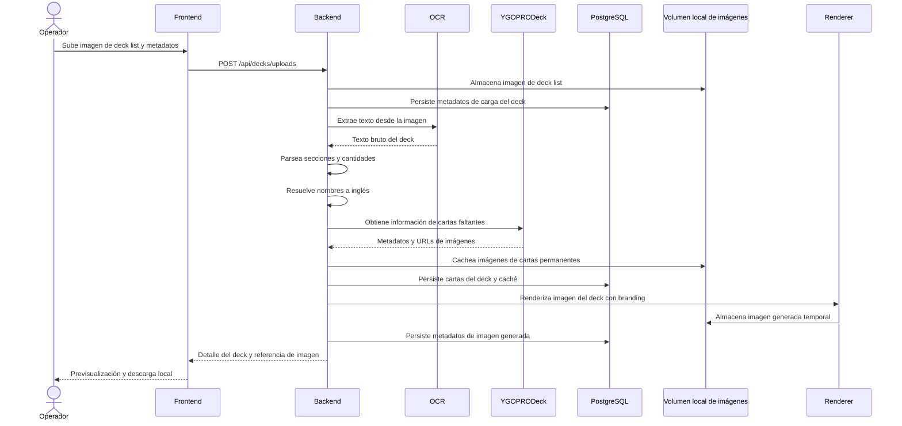

# YugiDeckStudio v0.1.0 - Diseño

## 1. Visión general

YugiDeckStudio se implementará como una aplicación full-stack local basada en Docker Compose.

El sistema recibe una imagen subida de deck list de Yu-Gi-Oh!, extrae datos del deck mediante OCR, resuelve nombres de cartas en inglés, obtiene información de cartas desde YGOPRODeck, cachea datos e imágenes, persiste el flujo completo del deck en PostgreSQL local y genera una imagen compartible con branding.

La versión `v0.1.0` no contempla despliegue a internet. La aplicación debe poder ejecutarse completamente en una máquina local, usando internet solo para consultar YGOPRODeck cuando no exista caché local.

## 2. Arquitectura

Arquitectura seleccionada:

- Backend: Clean Architecture / Hexagonal Architecture.
- Frontend: arquitectura modular basada en features.
- Stack backend: NestJS + TypeScript.
- Stack frontend: React + Vite + TypeScript.
- OCR: Tesseract OCR.
- Renderizado de imágenes: node-canvas.
- ORM y migraciones: Prisma.
- Pruebas backend: Jest.
- Pruebas frontend: Vitest + Testing Library.
- Server state frontend: TanStack Query.
- Imagen generada: `1080x1350` px.
- Plantillas: una plantilla base parametrizable para `v0.1.0`.
- Base de datos: PostgreSQL local.
- Infraestructura: Docker Compose local.
- Almacenamiento de imágenes: volumen Docker local.

El backend debe separar:

- Modelos y reglas de dominio.
- Casos de uso de aplicación.
- Puertos/interfaces.
- Adaptadores de infraestructura.
- Controladores HTTP/API.

Sistemas externos como proveedores OCR, YGOPRODeck, almacenamiento de archivos y generación de imágenes deben accederse mediante puertos y adaptadores.

## 3. Módulos backend propuestos

### Dominio

- Deck.
- DeckStatus.
- DeckSection.
- DeckCard.
- Card.
- Player.
- Tournament.
- TournamentType.
- EventType.
- Store.
- StoreBranding.
- StoreSocialLink.
- User.
- Role.
- Permission.
- ManagedImageAsset.
- GeneratedDeckImage.
- ImageRetentionPolicy.

### Casos de uso de aplicación

- UploadDeckListImageUseCase.
- ExtractDeckListFromImageUseCase.
- ResolveCardNamesUseCase.
- FetchCardDataUseCase.
- CacheCardImageUseCase.
- GenerateDeckImageUseCase.
- ConfigureStoreBrandingUseCase.
- ConfigureEventTypesUseCase.
- ConfigureTournamentTypesUseCase.
- ConfigureStoreSocialLinksUseCase.
- RegisterUserUseCase.
- LoginUserUseCase.
- InitializeRootUserUseCase.
- ConfigureFirstStoreAdminUseCase.
- ConfigureRolesUseCase.
- ConfigurePermissionsUseCase.
- AssignRoleToUserUseCase.
- AssignPermissionToRoleUseCase.
- CleanupTemporaryImagesUseCase.
- GetDeckDetailUseCase.

### Puertos

- OcrPort.
- CardCatalogPort.
- CardImageStoragePort.
- DeckImageRendererPort.
- DeckRepository.
- CardRepository.
- BrandingRepository.
- EventTypeRepository.
- TournamentTypeRepository.
- UserRepository.
- RoleRepository.
- PermissionRepository.
- ImageAssetRepository.
- PasswordHasherPort.
- AuthTokenPort.
- AuthorizationPolicyPort.
- FileStoragePort.
- SchedulerPort.

### Adaptadores de infraestructura

- YgoprodeckCardCatalogAdapter.
- PostgresDeckRepository.
- PostgresCardRepository.
- PostgresBrandingRepository.
- PostgresEventTypeRepository.
- PostgresTournamentTypeRepository.
- PostgresUserRepository.
- PostgresRoleRepository.
- PostgresPermissionRepository.
- PostgresImageAssetRepository.
- BcryptPasswordHasherAdapter.
- LocalJwtAuthTokenAdapter.
- PermissionAuthorizationPolicyAdapter.
- LocalDockerVolumeFileStorageAdapter.
- TesseractOcrAdapter.
- NodeCanvasDeckImageRendererAdapter.
- LocalSchedulerAdapter.

## 4. Módulos frontend propuestos

- Página de carga de deck.
- Página de revisión de extracción.
- Página de configuración de tienda.
- Página de configuración de tipos de eventos.
- Página de configuración de tipos de torneos.
- Página de configuración de redes sociales.
- Página de login.
- Página de registro.
- Página de configuración de usuarios.
- Página de configuración de roles y permisos.
- Página de previsualización de imagen generada.
- Componentes UI compartidos.
- Módulo cliente de API.

## 5. Flujo principal

1. El operador sube una imagen de deck list con metadatos obligatorios.
2. El backend valida metadatos y restricciones del archivo.
3. El backend almacena la imagen en el volumen local de imágenes.
4. El backend persiste metadatos de la carga en PostgreSQL.
5. El OCR extrae texto bruto y secciones del deck.
6. El backend parsea cantidades y nombres de cartas.
7. El backend resuelve nombres a nombres de cartas en inglés.
8. El operador revisa entradas no resueltas o de baja confianza.
9. El backend consulta YGOPRODeck para las cartas resueltas que no existan en caché.
10. El backend cachea metadatos e imágenes de cartas.
11. El backend persiste la composición final del deck.
12. El backend renderiza la imagen del deck con branding.
13. El backend almacena la imagen generada en el volumen local de imágenes.
14. El frontend muestra previsualización y acción de descarga local.

## 6. Propuesta de modelo de datos

### stores

- id.
- name.
- primary_logo_asset_id.
- secondary_logo_asset_id.
- background_image_asset_id.
- source_credit_text.
- created_at.
- updated_at.

### store_social_links

- id.
- store_id.
- platform.
- handle.
- url.
- icon_asset_id.
- display_order.
- is_active.

### users

- id.
- store_id. Nulo únicamente para `root`.
- username.
- email.
- password_hash.
- display_name.
- is_root.
- must_change_password.
- is_active.
- created_at.
- updated_at.

### roles

- id.
- name.
- description.
- is_system_role.
- created_at.
- updated_at.

### permissions

- id.
- code.
- description.
- created_at.
- updated_at.

### stores

Los datos asociados a una tienda deben usar `store_id` para aplicar aislamiento multi-tienda.

Las entidades con alcance de tienda incluyen:

- store_social_links.
- event_types.
- tournament_types.
- tournaments.
- decks.
- generated_deck_images mediante deck.
- usuarios no-root.
- assets configurables de tienda, evento, redes y fondos.

### user_roles

- user_id.
- role_id.

### role_permissions

- role_id.
- permission_id.

### event_types

- id.
- store_id.
- name.
- description.
- logo_asset_id.
- is_active.
- created_at.
- updated_at.

### tournament_types

- id.
- store_id.
- name.
- description.
- logo_asset_id.
- is_active.
- created_at.
- updated_at.

### players

- id.
- display_name.
- created_at.
- updated_at.

### tournaments

- id.
- store_id.
- event_type_id.
- tournament_type_id.
- name.
- event_date.
- location.
- created_at.
- updated_at.

### decks

- id.
- player_id.
- tournament_id.
- store_id.
- deck_name.
- result_label.
- uploaded_image_asset_id.
- raw_ocr_text.
- extraction_status.
- review_status.
- status.
- inactive_at.
- inactive_by_user_id.
- inactivity_reason.
- created_at.
- updated_at.

### deck_cards

- id.
- deck_id.
- section.
- quantity.
- original_name.
- resolved_english_name.
- card_id.
- confidence_score.
- resolution_status.
- display_order.

### cards

- id.
- ygoprodeck_id.
- official_name.
- card_type.
- frame_type.
- image_asset_id.
- image_url_source.
- raw_payload_json.
- last_used_at.
- created_at.
- updated_at.

### generated_deck_images

- id.
- deck_id.
- image_asset_id.
- template_name.
- width. Valor esperado para `v0.1.0`: `1080`.
- height. Valor esperado para `v0.1.0`: `1350`.
- created_at.

### managed_image_assets

- id.
- category.
- storage_path.
- original_filename.
- mime_type.
- size_bytes.
- checksum.
- width.
- height.
- retention_policy.
- last_used_at.
- created_at.
- deleted_at.

Categorías propuestas:

- `uploaded_decklist`.
- `generated_deck_image`.
- `card_image`.
- `store_logo`.
- `event_logo`.
- `social_logo`.
- `background_image`.

Políticas de retención propuestas:

- `temporary_cleanup_allowed` para deck lists subidos e imágenes generadas.
- `permanent` para cartas, logos de tienda, logos de evento, logos/iconos de redes sociales y fondos activos.

## 7. Propuesta de API

Los contratos finales de API deben documentarse antes de la implementación. Endpoints candidatos iniciales:

- `POST /api/decks/uploads`
- `GET /api/decks/{deckId}`
- `POST /api/decks/{deckId}/extract`
- `PUT /api/decks/{deckId}/cards`
- `POST /api/decks/{deckId}/generate-image`
- `GET /api/decks/{deckId}/generated-image`
- `GET /api/stores/current`
- `PUT /api/stores/current`
- `GET /api/stores/current/social-links`
- `PUT /api/stores/current/social-links`
- `POST /api/auth/register`
- `POST /api/auth/login`
- `POST /api/auth/root/initialize`
- `POST /api/auth/root/store-admin`
- `GET /api/users`
- `POST /api/users`
- `PUT /api/users/{userId}`
- `GET /api/roles`
- `POST /api/roles`
- `PUT /api/roles/{roleId}`
- `GET /api/permissions`
- `PUT /api/roles/{roleId}/permissions`
- `PUT /api/users/{userId}/roles`
- `GET /api/event-types`
- `POST /api/event-types`
- `PUT /api/event-types/{eventTypeId}`
- `GET /api/tournament-types`
- `POST /api/tournament-types`
- `PUT /api/tournament-types/{tournamentTypeId}`
- `POST /api/maintenance/image-cleanup/run`

## 8. Diseño de generación de imagen

La plantilla por defecto debe soportar:

- Tamaño final `1080x1350` px.
- Layout vertical para redes sociales.
- Área superior con logos configurables.
- Área de título con resultado del torneo y nombre del jugador.
- Tipo de evento o torneo cuando aplique.
- Grilla de Main Deck.
- Fila o grilla de Extra Deck.
- Fila o grilla de Side Deck.
- Área inferior con redes sociales y fuente/crédito.

El renderer debe recibir datos estructurados del deck y configuración de branding. No debe consultar APIs externas directamente.

La versión `v0.1.0` tendrá una sola plantilla base parametrizable.

La tienda puede configurar fondo propio o color de fondo. Si existe fondo propio activo, el renderer debe usarlo con prioridad. Si no existe fondo propio activo, debe usar el color de fondo configurado por la tienda.

## 8.1 Diseño de autenticación y autorización

La aplicación tendrá autenticación local.

El usuario `root` será el usuario de mayor privilegio y debe existir para inicializar la tienda.

El usuario `root` se crea como primer usuario de la base de datos mediante seed/migración inicial con credenciales genéricas locales.

El usuario `root` debe tener `must_change_password = true` hasta que cambie su contraseña en el primer inicio de sesión.

Responsabilidades de `root`:

- Crear o parametrizar el primer usuario administrador de tienda.
- Crear y administrar tiendas.
- Crear y editar roles.
- Crear y editar permisos cuando aplique.
- Asignar permisos a roles.
- Asignar roles a usuarios.
- Ver y administrar información de todas las tiendas.

Las contraseñas deben almacenarse usando hashing seguro.

La autorización debe basarse en permisos, no solo en nombres de rol.

Los controladores HTTP deben validar permisos antes de ejecutar casos de uso protegidos.

La autorización también debe validar alcance:

- `global`: permitido únicamente para `root`.
- `store`: permitido para usuarios no-root dentro de su `store_id`.

Los usuarios no-root siempre deben estar vinculados a una tienda.

Los repositorios y casos de uso deben recibir el contexto del usuario autenticado para aplicar filtros por `store_id`.

No se permite confiar únicamente en filtros de frontend para aislar información.

Roles iniciales recomendados:

- `root`.
- `store_admin`, mostrado en UI como "Administrador de tienda".
- `operator`.

Reglas de usuarios:

- Solo puede existir un `root` en toda la aplicación.
- Cada tienda puede tener un solo `store_admin`.
- Cada tienda puede tener N usuarios `operator`.
- Solo `root` puede crear tiendas.
- Solo `root` puede crear o parametrizar el primer `store_admin` de una tienda.
- `root` puede crear operadores en cualquier tienda.
- `store_admin` puede crear operadores en su tienda.
- `operator` no puede crear usuarios.

Permisos iniciales:

- `root`: todos los permisos globales.
- `store_admin`: configuración de tienda, eventos, torneos, redes, logos, usuarios operadores, decks e imágenes de su tienda.
- `operator`: carga de deck lists, revisión de extracción, corrección previa a generación, generación y descarga de imágenes de su tienda.

## 8.2 Diseño de ciclo de vida del deck

Estados propuestos de deck:

- `uploaded`.
- `extracted`.
- `reviewed`.
- `image_generated`.
- `inactive`.

Reglas:

- El deck list subido no se puede reemplazar sobre el mismo deck.
- La revisión OCR es obligatoria antes de generar imagen.
- Antes de generar imagen se permite corregir cartas extraídas.
- Después de generar imagen, el operador no puede eliminar ni inactivar el deck.
- Después de generar imagen, solo `store_admin` o `root` pueden inactivar el deck.
- Inactivar el deck aplica soft delete o estado inactivo sobre la data.
- Los archivos físicos de deck list subido e imagen generada pueden eliminarse según retención o inactivación administrativa.

## 8.3 Diseño de modo sin internet

La integración con YGOPRODeck debe soportar fallo de conectividad.

Reglas:

- Si todas las cartas e imágenes requeridas están cacheadas localmente, la imagen puede generarse sin internet.
- Si falta alguna carta o imagen y no hay conexión a YGOPRODeck, la generación debe bloquearse.
- El error debe informar qué cartas o imágenes faltan.

## 9. Diseño de OCR y resolución de nombres

El OCR se aísla detrás de `OcrPort`.

La resolución de nombres debe:

- Conservar el texto original del OCR.
- Normalizar espacios y errores comunes de OCR.
- Intentar coincidencia exacta contra nombres de cartas cacheados.
- Intentar consulta exacta a YGOPRODeck por `name` cuando exista un nombre en inglés confiable.
- Intentar consulta difusa cuando la resolución exacta falle.
- Marcar cartas no resueltas para corrección manual.

El sistema no debe reemplazar silenciosamente cartas ambiguas.

## 10. Diseño de integración con YGOPRODeck

El acceso a YGOPRODeck se aísla detrás de `CardCatalogPort`.

El adaptador debe:

- Respetar límites de solicitudes.
- Agrupar búsquedas cuando sea posible usando `name` con nombres separados por `|`.
- Almacenar payloads de API para trazabilidad.
- Cachear resultados exitosos de cartas.
- Evitar hotlinking permanente delegando la descarga de imágenes a `CardImageStoragePort`.

## 11. Diseño Docker local

Docker Compose es la única estrategia de ejecución para `v0.1.0`.

Servicios locales propuestos:

- `frontend`.
- `backend`.
- `postgres`.
- `image-storage` o módulo equivalente de backend para servir imágenes desde volumen local.
- `image-cleaner` o job programado equivalente para depuración semanal.

Volúmenes propuestos:

- `yugideck_postgres_data`.
- `yugideck_image_data`.

No se debe diseñar despliegue a internet en esta fase.

## 12. Diseño de depuración de imágenes

La depuración semanal debe trabajar sobre metadatos de `managed_image_assets`.

Debe eliminar físicamente y marcar como eliminadas solo imágenes con:

- categoría `uploaded_decklist` o `generated_deck_image`;
- política `temporary_cleanup_allowed`;
- antigüedad mayor o igual a 7 días;
- sin bloqueo explícito de retención.

No debe eliminar assets con:

- categoría `card_image`;
- categoría `store_logo`;
- categoría `event_logo`;
- categoría `social_logo`;
- categoría `background_image` activa;
- política `permanent`.

La duración de retención definida para `v0.1.0` es de 7 días.

## 13. Consideraciones de seguridad

- Validar tamaño de archivo y content type de uploads.
- Almacenar archivos fuera de rutas ejecutables.
- Evitar registrar en logs el contenido de imágenes subidas o datos sensibles.
- Validar todos los cuerpos de solicitud.
- No hardcodear credenciales ni secretos de base de datos.
- Usar `.env.example`, no `.env`.
- No exponer servicios fuera de localhost o la red local sin una decisión técnica posterior.

## 14. Consideraciones de observabilidad

Los logs estructurados deben incluir:

- deck_id.
- image_asset_id cuando aplique.
- upload_id cuando aplique.
- nombre de operación.
- nombre del proveedor externo.
- duración.
- estado.

No registrar payloads completos de APIs externas en nivel info.

## 15. Diagrama de secuencia Mermaid

